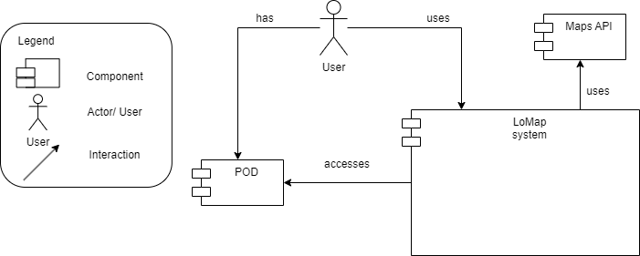
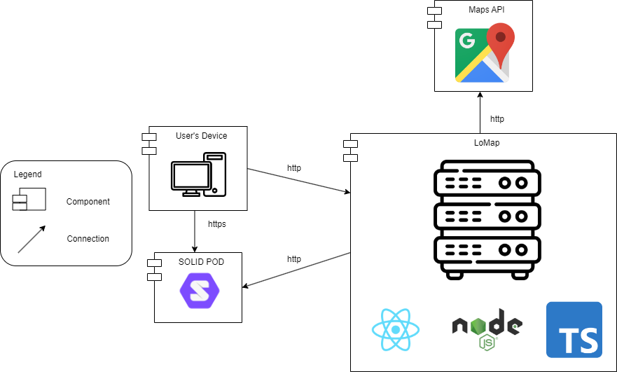

[[section-system-scope-and-context]]
== System Scope and Context

[role="arc42help"]
****
.Contents
System scope and context - as the name suggests - delimits your system (i.e. your scope) from all its communication partners
(neighboring systems and users, i.e. the context of your system). It thereby specifies the external interfaces.

If necessary, differentiate the business context (domain specific inputs and outputs) from the technical context (channels, protocols, hardware).

.Motivation
The domain interfaces and technical interfaces to communication partners are among your system's most critical aspects. Make sure that you completely understand them.

.Form
Various options:

* Context diagrams
* Lists of communication partners and their interfaces.
****

=== Business Context:

:imagesdir: images/

The main components that the LoMap system interacts with are: Database, Maps API, POD.

The final user has a POD and uses the LoMap system to save and share maps. The LoMap system can also access the user's POD to store information. Due to decitions to increase the throwput of the application, some data will be stored in a database.

=== Technical Context:

:imagesdir: images/

The components of the application use certain technologies and communicate with eachother using different channels. The LoMap application will be programmed mostly using TypeScript and the React and Node JS Express frameworks. The Pod will be a SOLID POD and the database will be a MongoDB database. The connections that happen between LoMap, the user's device and the SOLID PODs follow the https protocol, so the information is secure. LoMap will use a Google Maps API, and the connections will use http. Finally, to access the Mongo DB database, LoMap will follow the MongoDB Wire Protocol.
