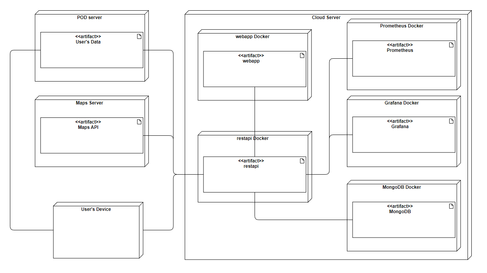

[[section-deployment-view]]

== Deployment View

The LoMap system will run for the most part in the user's device, whether it is a smartphone or a personal computer. The system will be deployed using Docker images.

The webapp is the part of the system that the users will interact with. The restapi will be in charge of integrating all the other parts of the system. Prometheus and Grafana will monitor and give information about the restapi.

As it is shown in the diagram, the SOLID PODs, as well as the Maps API, are not part of the LoMap system.
